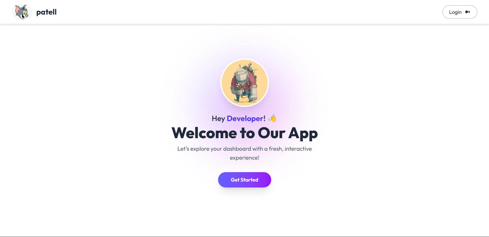
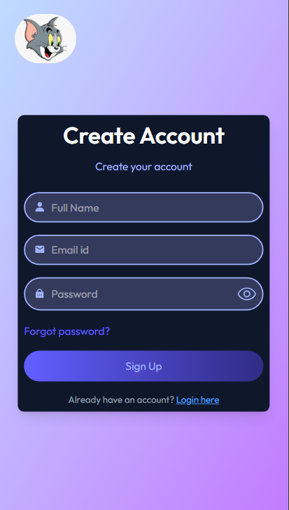
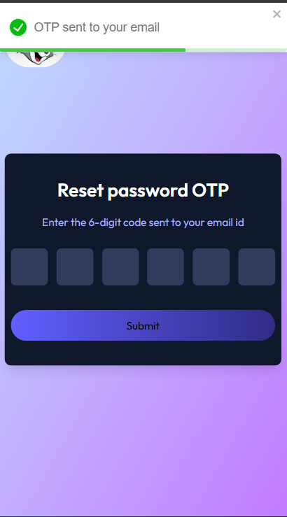
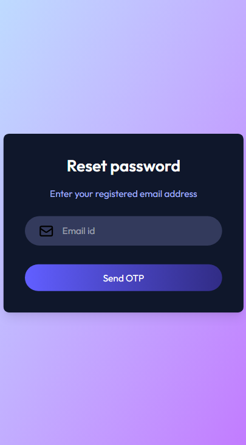
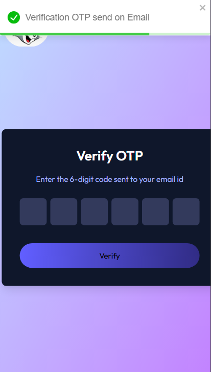
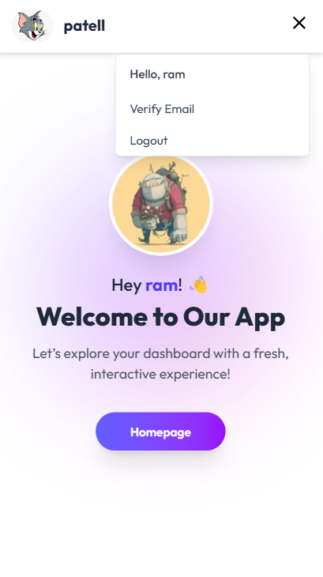

# 🔐 MERN Authentication System

A complete **MERN Stack Authentication System** with secure OTP email verification, password reset, and JWT-based login—all built with a modern UI.

---

## 🚀 Features

✅ Email OTP Verification  
🔁 Password Reset  
🔑 JWT Authentication  
📩 Email via Nodemailer  
🍞 Toast Notifications (React-Toastify)  
🌟 React Icons UI  

---

## 📸 Screenshots

| Homepage | Login Page | Reset-OTP-Sent |
|---------|------------|----------------|
|  |  |  |

| Reset Password | Email Verification | Login-After-View |
|----------------|---------------------|---------------------|
|  |  |  |

---

## 🧩 Core Functionalities

- 📝 **User Signup with Email OTP**
- 🔐 **Secure Login with JWT**
- ✉️ **Email-based Password Reset**
- 🚫 **Protected Routes (Frontend + Backend)**
- 📢 **Toast Alerts for Feedback**
- 💅 **Modern, Interactive UI with React Icons**

---

## 🛠️ Tech Stack

**Frontend:**  
- React  
- React Router DOM  
- Axios  
- React Toastify  
- React Icons  

**Backend:**  
- Node.js + Express.js  
- MongoDB + Mongoose  
- Nodemailer  
- JSON Web Tokens (JWT)

---

## 📦 Installation & Setup

### Step 1️⃣: Clone the Repository

```bash
git clone https://github.com/Bharat8327/UserAuthLogin.git
cd MernAuth
